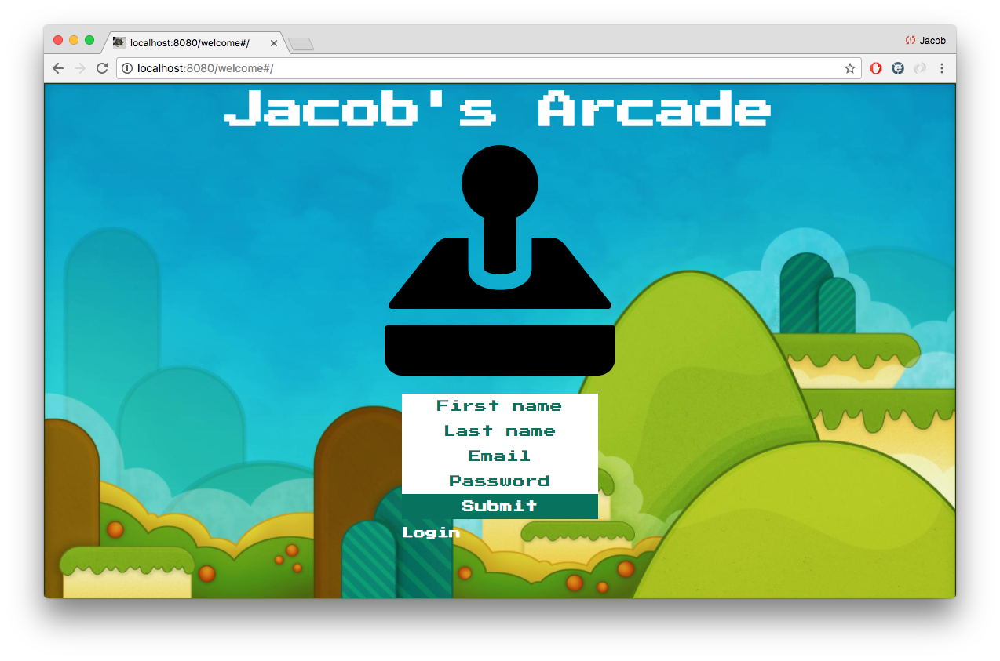
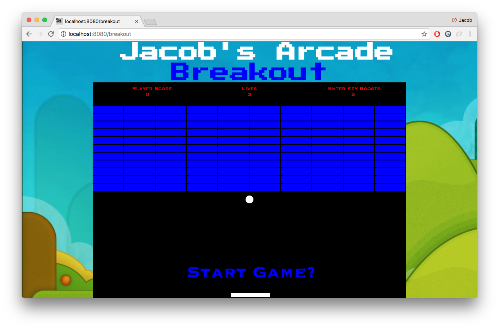

# Jacob's Arcade

## Website

https://jacobsarcade.herokuapp.com/

## Overview

This full stack project was my final project at SPICED Academy. We were allowed one week to come up with any javascript application of our choosing. I love games and very much enjoyed working with canvas so I decided to create a small 2D game site.

## Technology

-- Application built with React --
 - Used ES6 JavaScript and React to build a custom application from the ground up.
 - Once logged in, users are able to play all the games on the site.
 - The 2D games are built with Javascript and Canvas.

This application starts off with a standard registration or login form. The information is stored in PostgreSQL with the password being hashed for good security.

Once registered or logged in, the user is taken to the home screen where they can choose what game they would like to play.

Once the user clicks on the game of their choice, they are taken to new page where they can play the fully functioning game.

### Things I'm working on

--Creating a highscore chart with PostgreSQL that can track player's highest scores for the game of their choice.
